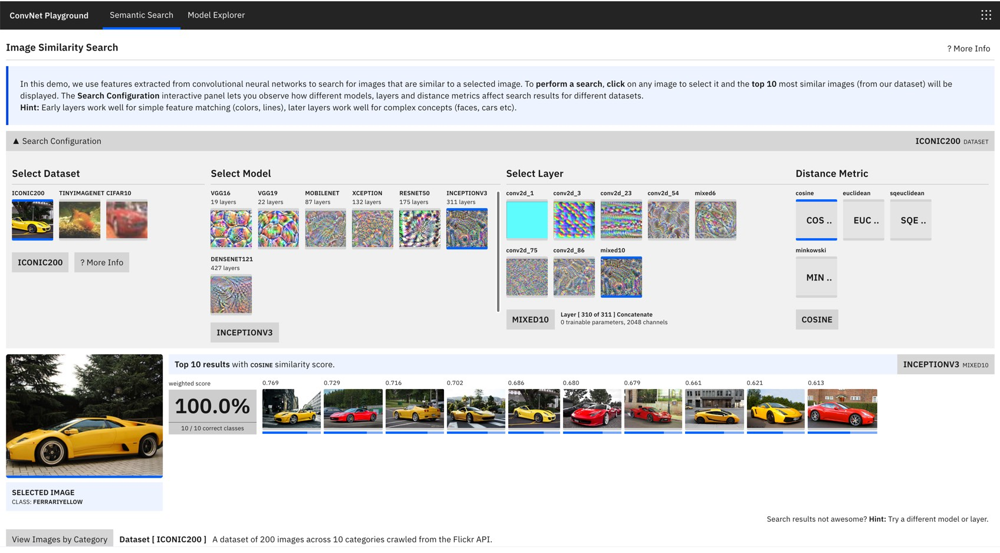

# ConveNet Playground

> A prototype that allows you explore how convolutional neural network models. It covers areas like feature extraction and semantic search (image retrieval), visualizations of internal components of CNNs etc.

https://github.com/fastforwardlabs/semsearch

## How it works

## Semantic Similarity Search

### Datasets

Several datasets are used to demonstrate the process of semantic similarity search. 

#### TinyImagenet200. 
This dataset is a subset of the TinyImagenet dataset containing 200 images across 10 classes (20 images per class). The classess include "goldfish", "teapots", "faces", "shoes", "frogs" . These images are relatively small 64px * 64px, contain varying backgrounds and orientations within each class. They present a challenging test bed to evaluate the value of features extracted using a pretrained neural net.

### Iconic200
This dataset is manually curated for this project focuses on high resolution images that are likely to be observed in the real world. Classes are deliberately chosen to span images with similar concepts (various brands of cars). These images were sources from the flickr api (images with creative commons licenses).

### Extracting Images with Pretrained Neural Networks
We use the Keras library modelzoo which contains keras implementations of several well known convolutional neural networks for image analysis. We load a pretrained version of these implementations with weights learned from training on imagenet.

### Similarity Score Rating

For each of the extracted feature we compute a similarity score using multiple similarity distance metrics.

## Prototype Interface Design

The prototype interface is designed as a learning experience where the user is introduced to several concepts related to how CNNs work.

### Semantic Search

The interface provides access to 3 main datasets on which the user can view results of similarity rankings.
They can select a dataset, a model, a layer from the given model and a similarity metric value. For each model, de

As these configurations are selected the user is presented with a similarity search results based on their selections. For the given dataset, the first image is selected by default and the top 50 most similar images based on the configuration are shown.

The similarity metric is conveyed as a percentage bar below each image.

### Model Explorer
In this section the user is introduced to a list of well known CNN models and are able to explore visualizations of the layers and neurons within each model.

Select Model

We present implementations of a various model architectures using their standardized implementations provided in the Keras model zoo. These models are laid out in order of increasing complexity (number of layers). To explore the model in more detail, the user can select the "more info" button which provides an accessible table listing out each layer in the model.